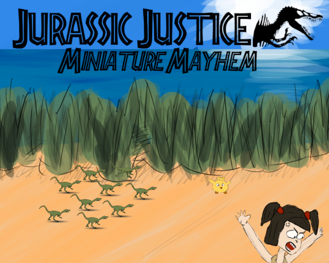

# Jurassic Justice: Miniature Mayhem

This is the repository of our game made for the Ludum Dare Game JAM 56.

It was made by:

* [Roulyo](https://github.com/roulyo)
* [Sp1d3rb0y](https://github.com/sp1d3rb0y)
* [Mogmi](https://github.com/Mogmi95)

It was more or less ouf first experience with Godot, and it was a fun one :).

All ressources was created by ourselves, except from the font.
